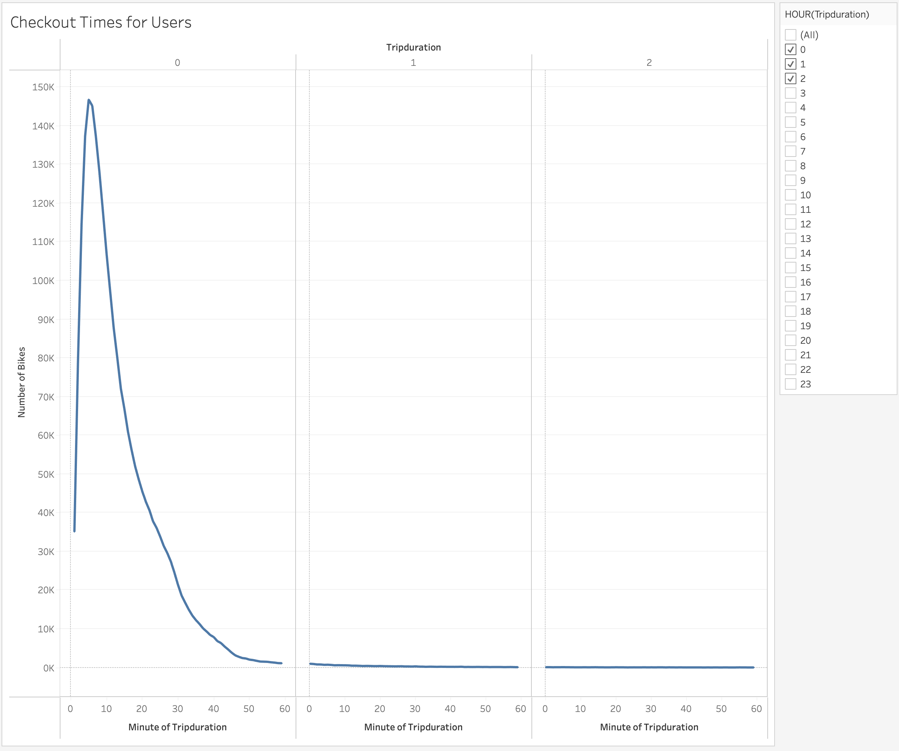
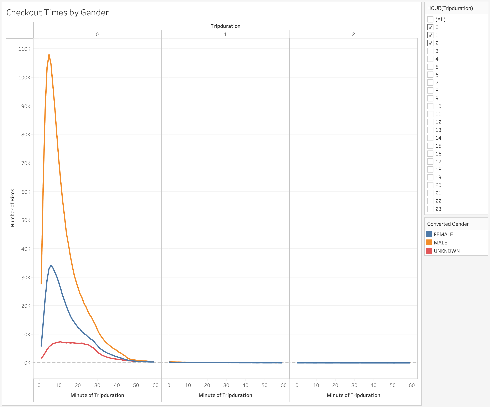
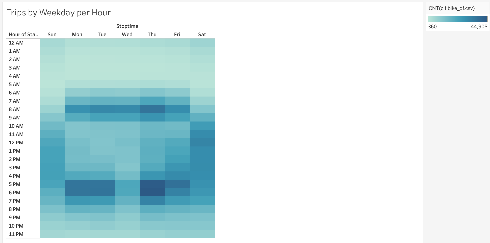
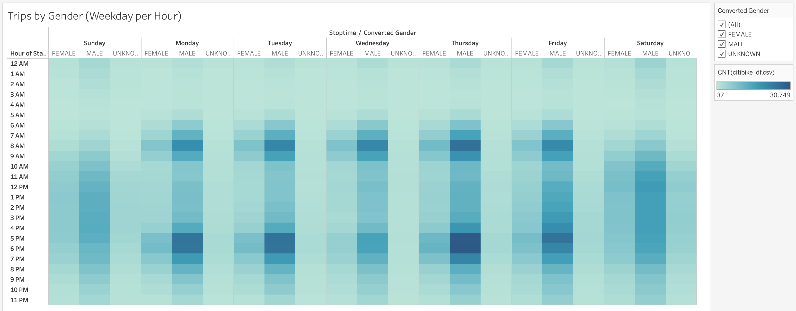
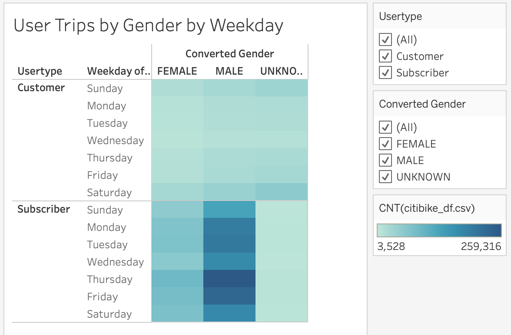
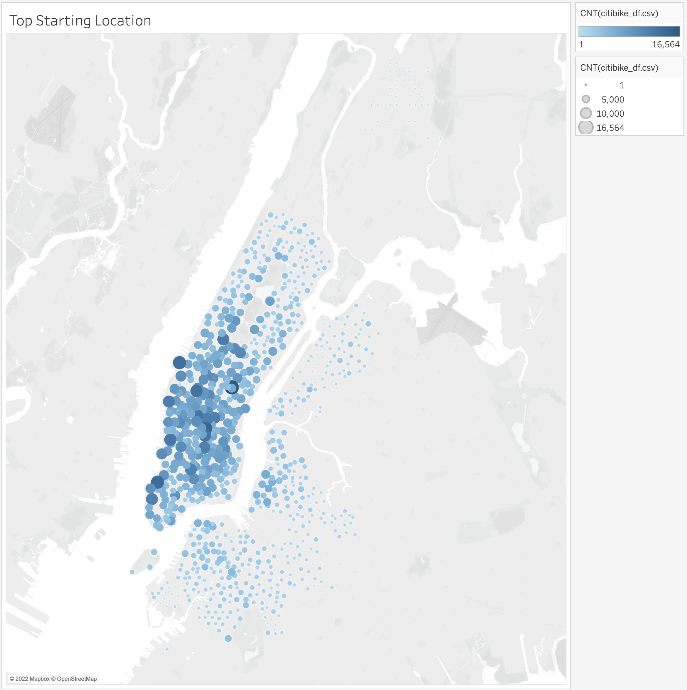
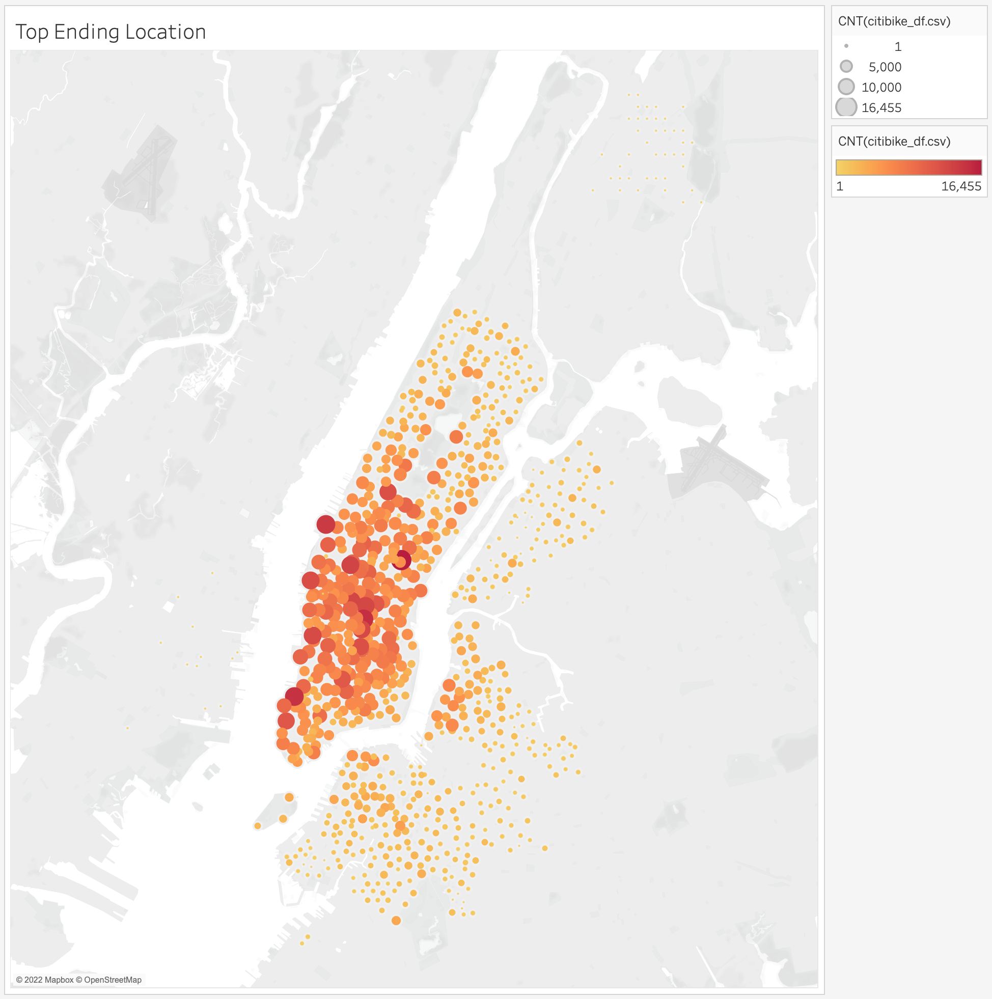

# bikesharing

## Overview
Katie is a Des Moines resident who recently completed a trip to New York City. While there, she fell in love with Citibike's bikesharing app and service. She wants to evaluate Citibike's public data to determine if a similar business model could work in Des Moines.

## Results

### 1. Checkout Times for Users

Trip duration lengths peak around 10 minutes, and quickly dissipate afterwards. Few trips last longer than one hour, suggesting that the bikes are used more for reaching destinations or commuting rather than being an activity in and of themselves.

### 2. Checkout Times by Gender

Trip duration lengths for both men and women peak around 10 minutes, although the rate of dissipating is slightly lower for women than men. Where genders are unknown, however, have a significantly lower dissipation rate, suggesting a potential third variable there (i.e., people who are more likely to not report gender are also more likely to take slightly longer trips).

### 3. Trips by Weekday per Hour

The busiest times for Citibike are between 7 and 9 AM and 5 and 6 PM during weekdays, suggesting that the bikes are used considerably for commuting. During the weekends, there is more of a spread during the day, suggesting that the bikes are used more than for exercise/activity.

### 4. Trips by Gender

There aren't major differences between how men and women use the Citibikes, except that there are simply more men than women riders.

### 5. User Trips by Gender by Weekday

Like the above graph (#4), except that there are no subscribers whose gender is unknown.

### 6. Top Starting Locations

The top starting locations are generally concentrated in Midtown. This, in combination with the other graphs, suggests that there are a high concentration of Midtown residents who use the bikes to commute to their Midtown offices.

### 7. Top Ending Locations

The above assumption is bolstered by the final graph. The difference between the starting and ending graphs are generally minimal.

## Summary
If the Des Moines bike project is going to thrive, it will need a solid base of commuters who live close to their work places, ideally in the downtown area. The second, less significant group will be a base of consumers who will use the bikes for activity and exercise on the weekends.

Two additional, potentially useful visualizations would include two maps for Top Starting and Ending Locations by weekday, to confirm the assumptions outlined above.
